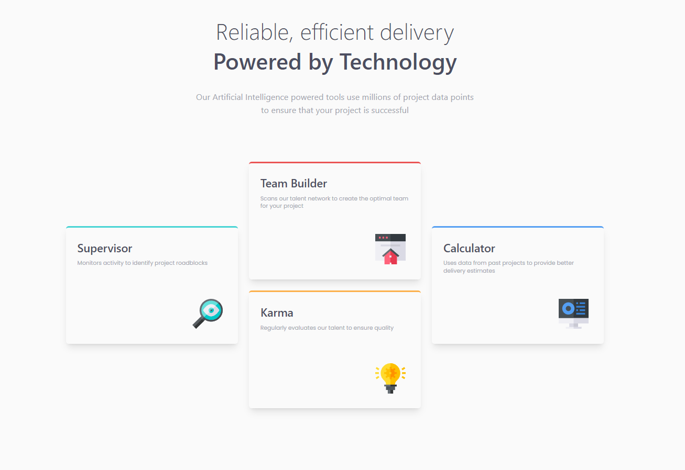

# Frontend Mentor - Four card feature section solution

This is a solution to the [Four card feature section challenge on Frontend Mentor](https://www.frontendmentor.io/challenges/four-card-feature-section-weK1eFYK). Frontend Mentor challenges help you improve your coding skills by building realistic projects.

## Table of contents

- [Screenshot](#screenshot)
- [Built with](#built-with)
- [What I learned](#what-i-learned)
- [Author](#author)

### Screenshot

- Live Site URL: (https://reactfourcards.netlify.app/)

### Built with

- React & TailwindCSS
- Grid & Flexbox
- Responsiveness

### What I learned

- Dynamic classes reactjs to handle props
- Tailwind Config
- Setting up react project

## Author

- LinkedIn - [Muhammad Raza](https://www.linkedin.com/in/frontend-developer-muhammad-raza/)
- Frontend Mentor - [@illusiveCode](https://www.frontendmentor.io/profile/illusiveCode)

### Thanks for reading!
